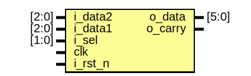

# Unsigned accumulator

- **File**: uns_acc.v
- **Author:** Agustin Matias Ortiz (aortiz@frba.utn.edu.ar)
- **Version:** 1.0
- **Date:** 02/09/2022
- **Brief:** Unsigned accumulator with adder input selection
- **Details:** Given the extension of the input word that the 
 statement shows, it is assumed that it is an unsigned 
 circuit and therefore it is appropriate to speak of Carry and not Overflow.
## Diagram

## Ports

| Port name | Direction | Type  | Description                   |
| --------- | --------- | ----- | ----------------------------- |
| o_data    | output    | [5:0] | Acc output                    |
| o_carry   | output    |       | Carry output                  |
| i_data2   | input     | [2:0] | Data imput                    |
| i_data1   | input     | [2:0] | Data imput                    |
| i_sel     | input     | [1:0] | Input selection signal        |
| clk       | input     |       | Clock                         |
| i_rst_n   | input     |       | Asynchronous reset active low |
## Signals

| Name      | Type       | Description             |
| --------- | ---------- | ----------------------- |
| ext_data1 | wire [3:0] | word extention          |
| ext_data2 | wire [3:0] | word extention          |
| sel_out   | reg  [3:0] | input MUX               |
| adder_out | wire [6:0] | next state adder output |
## Processes
- input_selector: ( @(*) )
  - **Type:** always
  - **Description**
 Mux of selection of the input data to accumulate 
- accumulator: ( @(posedge clk or negedge i_rst_n) )
  - **Type:** always
  - **Description**
 accumulator register 
