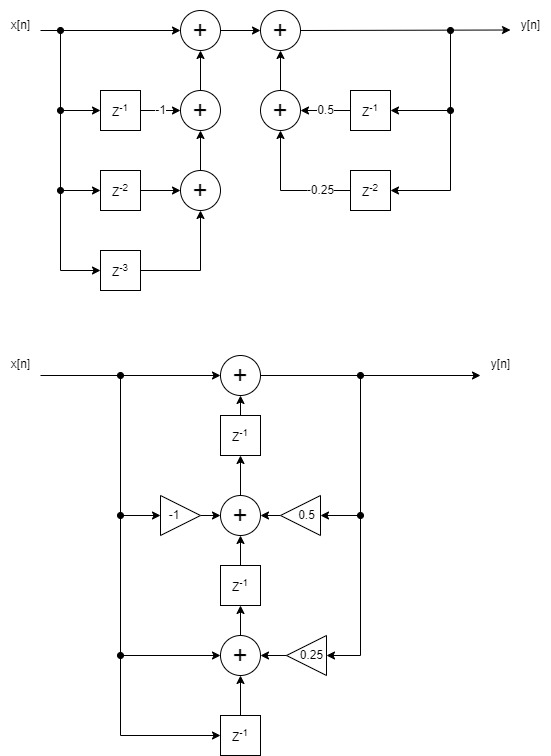

# Differential equation

- **File**: diffeq.v
- **Author:** Agustin Matias Ortiz (aortiz@frba.utn.edu.ar)
- **Version:** 1.0
- **Date:** 02/09/2022
- **Brief:** Ordinary differential equation
- **Details:** A circuit is implemented that performs the following 
 differential equation:

  y[n] = x[n] −x[n −1] + x[n −2] + x[n −3] + 0,5y[n −1] + 0,25y[n −2]

  Rewriting to pool registers as delays (Y = Y(Z)):

  

  Block diagram:

  
  
## Diagram

## Generics

| Generic name | Type | Value | Description |
| ------------ | ---- | ----- | ----------- |
| N            |      | 16    | Word lenght |
## Ports

| Port name | Direction | Type           | Description                   |
| --------- | --------- | -------------- | ----------------------------- |
| o_y       | output    | [N-1:0]        | output register               |
| i_x       | input     | signed [N-1:0] | Input signal                  |
| clk       | input     |                | Clock                         |
| i_rst     | input     |                | Asynchronous reset active low |
## Signals

| Name | Type             | Description |
| ---- | ---------------- | ----------- |
| reg1 | reg signed [N:0] | unit delays |
| reg2 | reg signed [N:0] | unit delays |
| reg3 | reg signed [N:0] | unit delays |
## Processes
- Delays: ( @(posedge clk or posedge i_rst) )
  - **Type:** always
  - **Description**
  Delays register with asynchronous reset 
