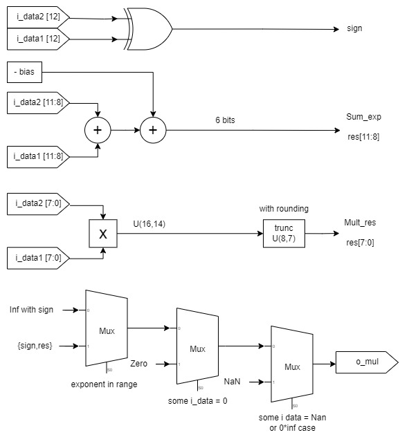

# Floating point multiplier

- **File**: fpmul.v
- **Author:** Agustin Matias Ortiz (aortiz@frba.utn.edu.ar)
- **Version:** 1.0
- **Date:** 24/09/2022
- **Brief:** Unsigned accumulator with adder input selection
- **Details:** Multiplier of values whose format is: 
## Diagram

## Description
      
 |bits    |  12  |  [11:8]  |   [7:0]  |
 |---     |---   |---       |---       |
 |function| Sign | Exponent | Mantissa |
      

## Ports

| Port name | Direction | Type   | Description |
| --------- | --------- | ------ | ----------- |
| i_data1   | input     | [12:0] | Data input  |
| i_data2   | input     | [12:0] | Data input  |
| o_mul     | output    | [12:0] | Result      |
## Signals

| Name       | Type              | Description                   |
| ---------- | ----------------- | ----------------------------- |
| Sign       | wire              | Calculation of sign of result |
| Mantissa   | reg         [7:0] | Truncation of multiplication  |
| Mult_res   | wire [15:0]       | Res of multiplication only    |
| Sum_exp    | wire [5:0]        | Sum of exponent - bias        |
| Nan_check  | wire              | Check if result must be NaN   |
| Zero_check | wire              | Check if result must be zero  |
## Constants

|Name	|Type	|Value	|Description|
|---	|---	|---	|---|
|nan	|[12:0]	|1_1111_1000_0000	|NaN representation|
|inf	|[11:0]	|x_1111_0000_0000	|Inf representation|
|zero|[11:0]	|x_0111_0000_0000	|Zero representation|

## Processes
- trunc: ( @(*) )
  - **Type:** always
  - **Description**
  Truncation, U(8.7) with rounding 

- exp_calc: ( @(*) )
  - **Type:** always
  - **Description**
  General operation 
