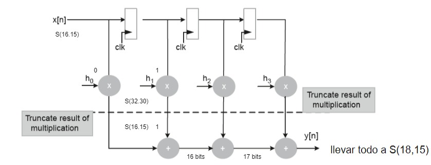

# Semi-generic FIR filter

- **File**: fir_direct.v
- **Author:** Agustin Matias Ortiz (aortiz@frba.utn.edu.ar)
- **Version:** 1.0
- **Date:** 01/11/2022
- **Brief:** 4 TAPS FIR filter
- **Details:** Although it is strictly a 4-stage transposed FIR, it is described in 
 such a way that it is easily scalable to more stages, however, the coefficients are imposed in the design. 
## Diagram

## Description

Generic instantiation is used for registers and multiplications, but, as the language does not allow taking some bits of choice from an element of an array, auxiliary registers must be generated for these purposes of truncating the result of the multipliers. The interesting thing is that only this stage and the sum stage are the ones that grow in the code.

 ### utility site: 

 - https://chummersone.github.io/qformat.html 

 - http://t-filter.engineerjs.com/

 - http://www.fdi.ucm.es/profesor/mendias/das/docs/DAStema6.pdf

 - https://www.airsupplylab.com/verilog-fpga/83-fpga-lesson-04-verilog-scalar,-vector,-and-array.html#arrays

## Generics

| Generic name | Type | Value | Description   |
| ------------ | ---- | ----- | ------------- |
| NTAPS        |      | 4     | Filter stages |
## Ports

| Port name | Direction | Type          | Description                   |
| --------- | --------- | ------------- | ----------------------------- |
| o_y       | output    | signed [17:0] | Output signal                 |
| i_x       | input     | signed [15:0] | Input signal                  |
| clk       | input     |               | Clock                         |
| i_rst     | input     |               | Asynchronous reset active low |
## Signals

| Name       | Type               | Description                                                |
| ---------- | ------------------ | ---------------------------------------------------------- |
| idx        | integer            | Index for generic processes                                |
| i_h        | reg signed  [15:0] | Coefficients array                                         |
| FiltReg    | reg signed  [15:0] | Filter registers array                                     |
| Mult       | reg signed  [31:0] | Multiplier registers array                                 |
| Sum        | wire [17:0]        | Adder results array                                        |
| Temp_mul_0 | wire [31:0]        | Auxiliary vector for clipping truncation of the multiplier |
| Temp_mul_1 | wire [31:0]        | Auxiliary vector for clipping truncation of the multiplier |
| Temp_mul_2 | wire [31:0]        | Auxiliary vector for clipping truncation of the multiplier |
| Temp_mul_3 | wire [31:0]        | Auxiliary vector for clipping truncation of the multiplier |
## Constants

| Name | Type   | Value                                                                                                                    | Description |
| ---- | ------ | ------------------------------------------------------------------------------------------------------------------------ | ----------- |
| zero | [15:0] | { { 16{ 1'b0}}} | Zeros       |
## Processes
- Coefficient_load: ( @(posedge i_rst) )
  - **Type:** always
  - **Description**
  Hardcode coeff load to register 
- Registers: ( @(posedge clk ) )
  - **Type:** always
  - **Description**
  Generic load of registers 
- Multiplication: ( @(posedge clk ) )
  - **Type:** always
  - **Description**
  Generic multiplication 
